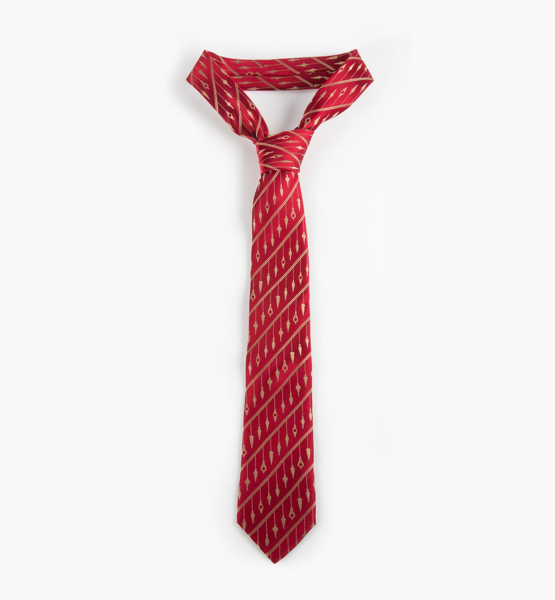
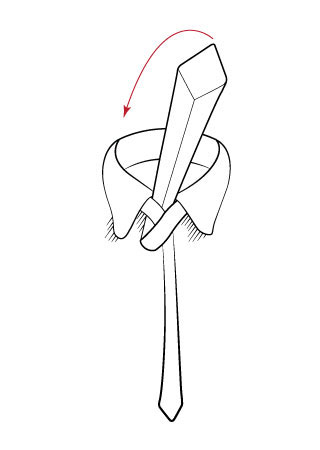
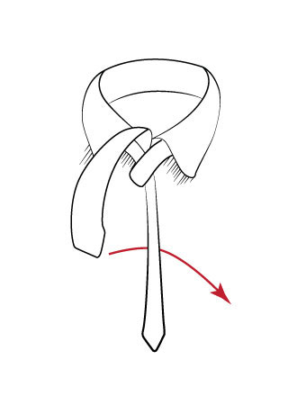
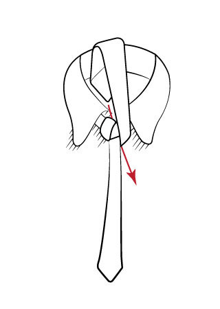
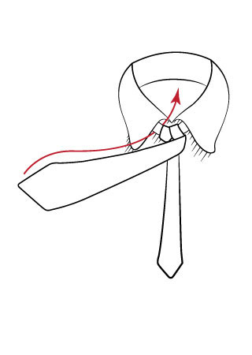
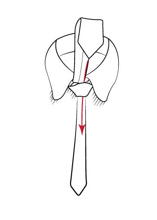
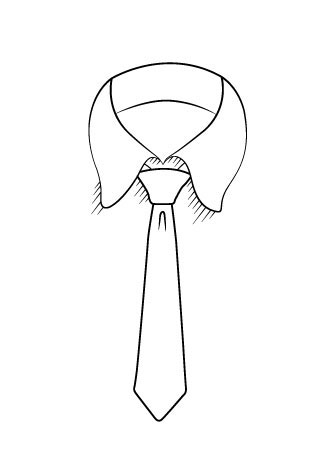

# How to Tie a Windsor Knot
The Windsor Knot is a stylish and easy way to wear a tie. It originated from the Duke of Windsor (King Edward VIII) where men tried to emulate his wide-knotted tie. 

## Materials
- A full length Tie 
    > Be sure to get a neck tie (pictured below), not a bow tie
    > 
- A mirror to watch yourself

## Instructions
1. Lengthen the Tie
    - Drape the Tie over your neck so that one side is shorter than the other
    - Make sure the shorter side is the thin part of the tie

2. Cross Over
    - Cross the longer side **over** the shorter side
    - Make sure you have a few inches of length left for the shorter side

3. Under-Over Loop
    - Holding the cross over piece, take the longer part and loop it from **under**
    - Pull it forward so that the long part is still hanging in front and towards the **left** side 
        > 

4. Wrap Around the Back
    - Take the longer end and while holding the knot, wrap it around the back so your right hand is holding it
    > 

5. Front Loop
    - Take the tie in your right hand and loop it **over** the knot
    - You should end up holding the knot in your right hand with your left holding the tie end
    > 

6. Under-Over Loop
    - Swing the tie end across the front of the knot
    - Pull it from **under** the knot but do **NOT** drape it over the front
    - ***Warning***: *Do **NOT** over-tighten the knot at this point, you will need some slack*
    > 

7. Create the Knot
    - Take the slack from step 6 and fish the tie through the opening
    - Your tie end should not be loose and alone, as the knot should be holding it back now
    > 

8. Tighten
    - Tighten the knot by squeezing the bottom while pushing up and pulling the short end of the tie down
    - ***Warning***: *Do **NOT** let the inner (smaller) piece exceed the outer (longer) piece in length.* 
    - You may need to restart to get the perfect measurement based on your neck
    > 

9. Finishing Up
    - Straighten the tie up
    - Pull your collar flaps down

This is what the final form should look like 
> 

*Pictures from www.images.google.com and www.tie-a-tie.net*